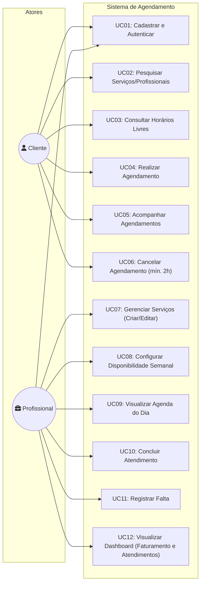

# Diagrama de Casos de Uso (Slide 6)

```mermaid
flowchart LR
    subgraph Atores
        Cliente(("fa:fa-user Cliente"))
        Profissional(("fa:fa-briefcase Profissional"))
    end

    subgraph Sistema ["Sistema de Agendamento"]
        UC01["UC01: Cadastrar e Autenticar"]
        UC02["UC02: Pesquisar Serviços/Profissionais"]
        UC03["UC03: Consultar Horários Livres"]
        UC04["UC04: Realizar Agendamento"]
        UC05["UC05: Acompanhar Agendamentos"]
        UC06["UC06: Cancelar Agendamento (mín. 2h)"]

        UC07["UC07: Gerenciar Serviços (Criar/Editar)"]
        UC08["UC08: Configurar Disponibilidade Semanal"]
        UC09["UC09: Visualizar Agenda do Dia"]
        UC10["UC10: Concluir Atendimento"]
        UC11["UC11: Registrar Falta"]
        UC12["UC12: Visualizar Dashboard (Faturamento e Atendimentos)"]
    end

    Cliente --> UC01
    Cliente --> UC02
    Cliente --> UC03
    Cliente --> UC04
    Cliente --> UC05
    Cliente --> UC06

    Profissional --> UC01
    Profissional --> UC07
    Profissional --> UC08
    Profissional --> UC09
    Profissional --> UC10
    Profissional --> UC11
    Profissional --> UC12
```
