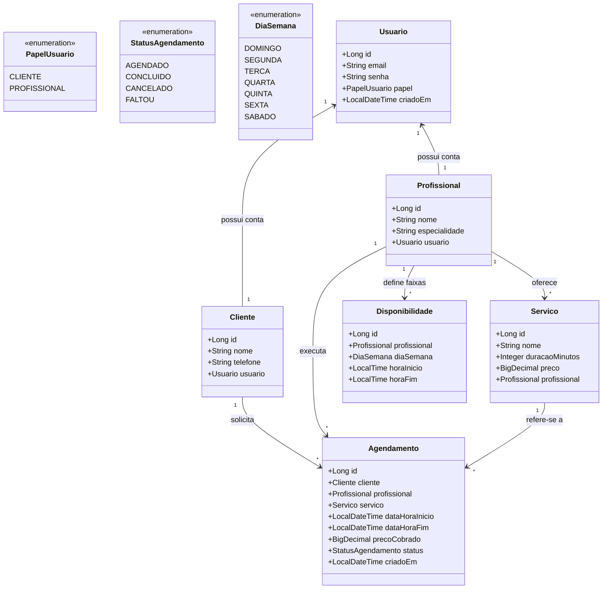

# Diagrama de Classes - MVP

```mermaid
classDiagram
    direction TB

    class PapelUsuario {
        <<enumeration>>
        CLIENTE
        PROFISSIONAL
    }

    class StatusAgendamento {
        <<enumeration>>
        AGENDADO
        CONCLUIDO
        CANCELADO
        FALTOU
    }

    class DiaSemana {
        <<enumeration>>
        DOMINGO
        SEGUNDA
        TERCA
        QUARTA
        QUINTA
        SEXTA
        SABADO
    }

    class Usuario {
        +Long id
        +String email
        +String senha
        +PapelUsuario papel
        +LocalDateTime criadoEm
    }

    class Cliente {
        +Long id
        +String nome
        +String telefone
        +Usuario usuario
    }

    class Profissional {
        +Long id
        +String nome
        +String especialidade
        +Usuario usuario
    }

    class Servico {
        +Long id
        +String nome
        +Integer duracaoMinutos
        +BigDecimal preco
        +Profissional profissional
    }

    class Disponibilidade {
        +Long id
        +Profissional profissional
        +DiaSemana diaSemana
        +LocalTime horaInicio
        +LocalTime horaFim
    }

    class Agendamento {
        +Long id
        +Cliente cliente
        +Profissional profissional
        +Servico servico
        +LocalDateTime dataHoraInicio
        +LocalDateTime dataHoraFim
        +BigDecimal precoCobrado
        +StatusAgendamento status
        +LocalDateTime criadoEm
    }

    Usuario "1" <-- "1" Cliente : possui conta
    Usuario "1" <-- "1" Profissional : possui conta
    Profissional "1" --> "*" Servico : oferece
    Profissional "1" --> "*" Disponibilidade : define faixas
    Cliente "1" --> "*" Agendamento : solicita
    Profissional "1" --> "*" Agendamento : executa
    Servico "1" --> "*" Agendamento : refere-se a
```
