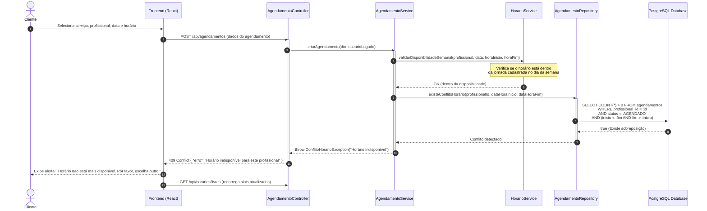

# Diagrama de Sequência: Agendamento com Conflito de Horário

Cenário: Cliente tenta agendar um horário que sobrepõe outro agendamento já confirmado do profissional.

```mermaid
sequenceDiagram
    autonumber
    actor Cliente
    participant Frontend as Frontend (React)
    participant Controller as AgendamentoController
    participant Service as AgendamentoService
    participant HorarioService as HorarioService
    participant Repo as AgendamentoRepository
    participant DB as PostgreSQL Database

    Cliente->>Frontend: Seleciona serviço, profissional, data e horário
    Frontend->>Controller: POST /api/agendamentos (dados do agendamento)
    
    activate Controller
    Controller->>Service: criarAgendamento(dto, usuarioLogado)
    activate Service

    Service->>HorarioService: validarDisponibilidadeSemanal(profissional, data, horaInicio, horaFim)
    Note over HorarioService: Verifica se o horário está dentro<br/>da jornada cadastrada no dia da semana
    HorarioService-->>Service: OK (dentro da disponibilidade)

    Service->>Repo: existeConflitoHorario(profissionalId, dataHoraInicio, dataHoraFim)
    activate Repo
    Repo->>DB: SELECT COUNT(*) > 0 FROM agendamentos<br/>WHERE profissional_id = :id<br/>AND status = 'AGENDADO'<br/>AND (inicio < :fim AND fim > :inicio)
    DB-->>Repo: true (Existe sobreposição)
    Repo-->>Service: Conflito detectado
    deactivate Repo

    Service-->>Controller: throw ConflitoHorarioException("Horário indisponível")
    deactivate Service

    Controller-->>Frontend: 409 Conflict { "erro": "Horário indisponível para este profissional" }
    deactivate Controller

    Frontend-->>Cliente: Exibe alerta: "Horário não está mais disponível. Por favor, escolha outro."
    Frontend->>Controller: GET /api/horarios/livres (recarrega slots atualizados)
```
